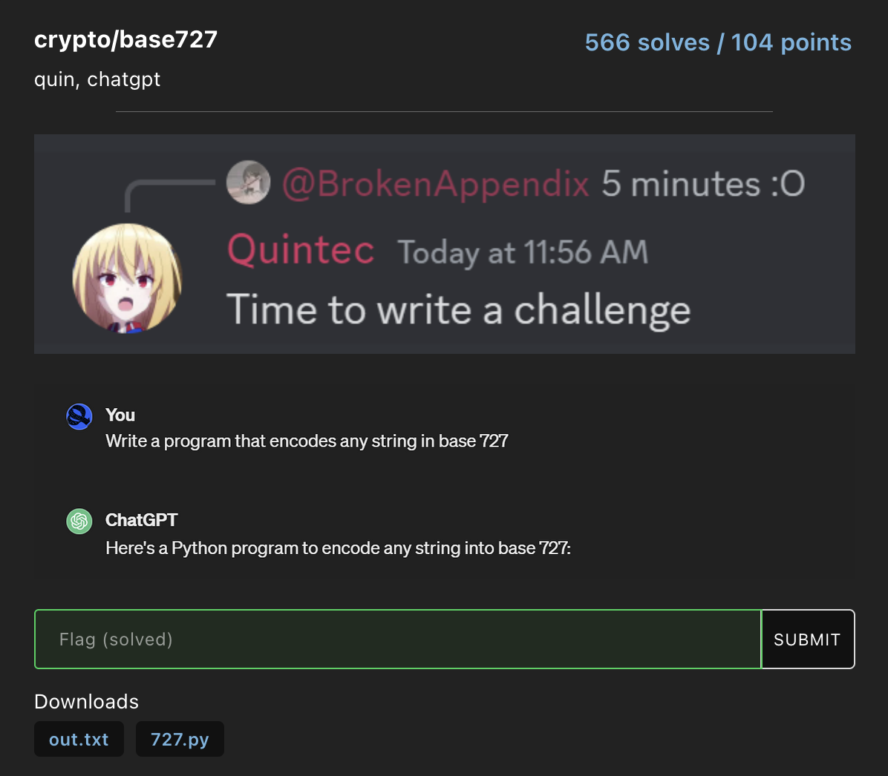

These are my writeups for [osu!gaming CTF 2024](https://ctftime.org/event/2165).

### blockchain/scorechain
> Snipe mr nathan on osu and claim the bounty in the very secure blockchain bancho!
> `nc chal2.osugaming.lol 8000`  
> — <cite>Triacontakai</cite>

This problem was my first time working with blockchain problems. I was provided the file [dist.zip](dist.zip), where it was a Rust Solana blockchain problem.

Initially looking at the [dist.zip](dist.zip), this is the directory of the challenge

```(base) rose@catputer scorechain % tree .
.
├── README.md
├── framework
│   ├── Cargo.lock
│   ├── Cargo.toml
│   ├── Dockerfile
│   ├── build_challenge.sh
│   ├── chall
│   │   ├── Anchor.toml
│   │   ├── Cargo.lock
│   │   ├── Cargo.toml
│   │   ├── migrations
│   │   │   └── deploy.ts
│   │   ├── package.json
│   │   ├── programs
│   │   │   └── chall
│   │   │       ├── Cargo.toml
│   │   │       ├── Xargo.toml
│   │   │       └── src
│   │   │           └── lib.rs
│   │   ├── tests
│   │   │   └── chall.ts
│   │   ├── tsconfig.json
│   │   └── yarn.lock
│   └── src
│       └── main.rs
└── framework-solve
    ├── Cargo.lock
    ├── Cargo.toml
    ├── build_solution.sh
    ├── solve
    │   ├── Anchor.toml
    │   ├── Cargo.lock
    │   ├── Cargo.toml
    │   ├── migrations
    │   │   └── deploy.ts
    │   ├── package.json
    │   ├── programs
    │   │   └── solve
    │   │       ├── Cargo.toml
    │   │       ├── Xargo.toml
    │   │       └── src
    │   │           └── lib.rs
    │   ├── tests
    │   │   └── solve.ts
    │   ├── tsconfig.json
    │   └── yarn.lock
    └── src
        └── main.rs

17 directories, 32 files
```

### reverse/SAT-before-osu
> My mom won’t let me play osu if I don’t study for the SAT but this looks nothing like it! Please help me! T^T<br>
> — <cite>BrokenAppendix</cite>

In this challenge, we're given the below system of equations that I've put into `constraints`. This is a set of systems and equations that can be easily solved with the z3 theorem prover.

```python
from z3 import *

a, b, c, d, e, f, g, h, i, j, k, l, m, n, o, p, q, r, s, t, u, v, w, x = Ints('a b c d e f g h i j k l m n o p q r s t u v w x')

constraints = [
    b + c + w == 314,
    t + d + u == 290,
    p + w + e == 251,
    v + l + j == 274,
    a + t + b == 344,
    b + j + m == 255,
    h + o + u == 253,
    q + l + o == 316,
    a + g + j == 252,
    q + x + q == 315,  
    t + n + m == 302,
    d + b + g == 328,
    e + o + m == 246,
    v + v + u == 271,  
    f + o + q == 318,
    s + o + j == 212,
    j + j + n == 197,  
    s + u + l == 213,
    q + w + j == 228,
    i + d + r == 350,
    e + k + u == 177,
    w + n + a == 288,
    r + e + u == 212,
    q + l + f == 321
]

solver = Solver()

solver.add(constraints)

if solver.check() == sat:
    solution = solver.model()
    # convert from number decimal to ascii
    ascii_output = ''.join(chr(solution[variable].as_long()) for variable in [a, b, c, d, e, f, g, h, i, j, k, l, m, n, o, p, q, r, s, t, u, v, w, x])
    print(ascii_output)
```

The flag that we get is `osu{0rZ_p3PpY_my_s4v1oR}`

### crypto/base727



We’re given the file [727.py](727.py) along with the encoded flag `06c3abc49dc4b443ca9d65c8b0c386c4b0c99fc798c2bdc5bccb94c68c37c296ca9ac29ac790c4af7bc585c59d`.

To decrypt, we write a script that is able to decode from a base727 encoded string to text, and decrypt the encoded flag:

```python
import binascii

def decode_base_727(encoded_hex):
    encoded_bytes = binascii.unhexlify(encoded_hex)
    encoded_string = encoded_bytes.decode()

    base = 727
    decoded_value = 0
    for char in encoded_string:
        decoded_value = decoded_value * base + ord(char)
    
    original_string = ""
    while decoded_value > 0:
        original_string = chr(decoded_value % 256) + original_string
        decoded_value //= 256

    return original_string

encoded_hex = "06c3abc49dc4b443ca9d65c8b0c386c4b0c99fc798c2bdc5bccb94c68c37c296ca9ac29ac790c4af7bc585c59d"  
original_string = decode_base_727(encoded_hex)
print(original_string)
```

And we get the flag `osu{wysiwysiwysiywsywiwywsi}`
